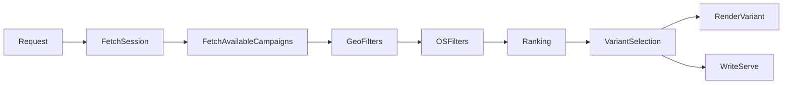

# Simula API Take Home

## Overview

Now that you have a CTR model and a candidate ranking algorithm, we want you to build the rest of the native-ad serving system around it.

There are three pieces you will be implementing:

1. Endpoints for managing campaigns, ad sets, and ad variants.
2. An endpoint for session management.
3. An endpoint for serving native ads.

## What you get

1. Sample native campaigns, ad sets and ad variants:
   - [`data/campaigns.json`](data/campaigns.json)
   - [`data/ad_sets.json`](data/ad_sets.json)
   - [`data/ad_variants.json`](data/ad_variants.json)
2. An HTML container to render the served assets/copy in (more on this in the ad serving section):
   - [`template/character_ad.html`](template/character_ad.html) — the native ad template, with `{{ PLACEHOLDER }}` fields you fill in at serve time (see [Template placeholders](#template-placeholders)).
   - [`template/test_harness.html`](template/test_harness.html) — open this locally to preview the rendered template in a scrollable feed.
3. Sample request/response structures (inline throughout this document).
4. An IP → country database: [`data/GeoLite2-City-Test.mmdb`](data/GeoLite2-City-Test.mmdb) (see [Test IPs](#test-ips)).
5. The LLM prompt for generating the character's message: [`prompts/character_dialogue.md`](prompts/character_dialogue.md).

## Goals

### Setup

1. Set up a cache and database of your choice.
2. Create collections for Campaigns, AdSets, AdVariants, and Serves. Definitions for each of these objects will be outlined in the following sections, but it's up to you to create the models.
3. Load sample Campaigns, AdSets and AdVariants from these files:
   - [`data/campaigns.json`](data/campaigns.json)
   - [`data/ad_sets.json`](data/ad_sets.json)
   - [`data/ad_variants.json`](data/ad_variants.json)
4. Set up a Temporal account (https://temporal.io/). You will need Temporal for at least one of the parts of this assignment.

### Campaign Routes

A campaign represents an advertiser's app or offer being promoted. It holds the campaign-level targeting (geo, OS), budget, store / redirect links, and references to the ad sets that carry its creatives.

1. Create a set of endpoints to create, read, update, and delete campaigns in the cache and database. `campaign_id`, `created_at`, `updated_at`, and `active` are API owned. The rest are settable via the endpoints below.

`POST /campaigns` — create a campaign.

```bash
curl -X POST {{API_URL}}/campaigns \
  -H "Content-Type: application/json" \
  -d '{
    "campaign_name": "Baba Casino — Summer Push",
    "advertiser_company_id": "acmp_baba",
    "daily_budget": 500.0,
    "geo_targets": ["US", "CA"],
    "os_targets": ["ios", "android"],
    "attribution_provider": "appsflyer",
    "ios_store_url": "https://apps.apple.com/app/id1234567890",
    "android_store_url": "https://play.google.com/store/apps/details?id=com.baba.casino",
    "native_ad_set_ids": ["adset_native_a"]
  }'
```

Required: `campaign_name`, `advertiser_company_id`. New campaigns default to inactive.

`GET /campaigns` — list campaigns (filters: `ids`, `surface`, `publisher_id`, `active`).

```bash
curl "{{API_URL}}/campaigns?surface=native&active=true"
```

`GET /campaigns/{campaign_id}` — fetch a single campaign.

```bash
curl {{API_URL}}/campaigns/camp_abc
```

`PATCH /campaigns/{campaign_id}` — update the given fields.

```bash
curl -X PATCH {{API_URL}}/campaigns/camp_abc \
  -H "Content-Type: application/json" \
  -d '{"active": true, "daily_budget": 750.0}'
```

`DELETE /campaigns/{campaign_id}` — delete a campaign.

```bash
curl -X DELETE {{API_URL}}/campaigns/camp_abc
```

2. Set up a cache for the campaigns so they can be read more quickly at serve time. Connect the endpoints to the cache.
3. Create a Temporal schedule that reads campaigns from the database and updates the cache every 1 hour.

### Adset Routes

An ad set is a group of creative assets for a campaign — characters, videos, CTAs, and AI prompts. An ad variant is one specific combination of those assets (a single character + video + CTA + prompt), and is what actually gets rendered at serve time.

1. Create an endpoint to create an ad set. Creating an ad set should generate its variants — the cartesian product of the asset lists — and link it to the campaign.

`POST /adsets` — create an ad set.

```bash
curl -X POST {{API_URL}}/adsets \
  -H "Content-Type: application/json" \
  -d '{
    "campaign_id": "camp_abc",
    "ad_set_name": "Baba — Hero Characters",
    "character_names": ["Luna", "Rex"],
    "video_urls": ["https://cdn.simula.ad/baba/luna.mp4"],
    "ctas": ["Play Free", "Install Now"],
    "ai_prompts": ["Excitedly tell a friend about the daily bonus."],
    "fallback_copy": ["Check this out!"]
  }'
```

### Session Management

A session represents a continuous engagement window for a single user. Every serve is tied to a `session_id`.

1. Create a `POST /session/create` route that resolves the caller to a stable user and returns a session id.

`POST /session/create` — resolve-or-create a session.

```bash
curl -X POST {{API_URL}}/session/create \
  -H "Content-Type: application/json" \
  -d '{ "ppid": "user_42" }'
```

Response: `{ "session_id": "sess_1234" }`. The user is resolved from `ppid`, or the request's ip address if `ppid` is not passed.

2. Only mint a new session after 30s of inactivity. For this assignment, use ad serves as a proxy for activity.

### Ad Serving

At a high level, the ad-serving workflow looks like this:



1. Set up an endpoint that fetches a native ad based on this sample request:

`POST /load/native` — serve a native sponsored-character ad for a feed slot.

```bash
curl -X POST {{API_URL}}/load/native \
  -H "Content-Type: application/json" \
  -d '{
    "position": 3,
    "session_id": "sess_1234",
    "context": {
      "searchTerm": "space adventure",
      "tags": ["sci-fi", "rpg"],
      "category": "roleplay",
      "title": "Galaxy Companion",
      "nsfw": false
    }
  }'
```

Required: `position` (feed index), `session_id`. Optional: `context` (relevance signals).

The response returns the `impression_id` of the serve and the raw HTML of the rendered template:

```json
{
  "impression_id": "imp_5678",
  "rendered_html": "<!DOCTYPE html><html lang=\"en\" data-theme=\"dark\">..."
}
```

2. Fetch the user's country and operating system based on their IP address and user-agent. For IP → country mapping, use this database: [`data/GeoLite2-City-Test.mmdb`](data/GeoLite2-City-Test.mmdb).
3. Filter out campaigns that do not match the user's country and operating system.
4. Rank the remaining campaigns using your CTR model and ranker. Think about a good way to store user and context features so your models can easily access them at inference time.
5. Select a random ad set and ad variant for the campaign you choose.
6. Generate the ad copy for the selected variant by passing its `ai_prompt` to an LLM, and use the returned text as the character's message in the rendered template. Use the prompt in [`prompts/character_dialogue.md`](prompts/character_dialogue.md) — fill `{{CHAR_NAME}}` with the variant's `character_name` and `{{ai_prompt}}` with the variant's `ai_prompt`. If the call fails, fall back to the ad set's `fallback_copy`.
7. Fill in the placeholder fields on the HTML template using the corresponding fields from the campaign and the ad variant.
8. Create a data model to store the contents of a serve. Use this model to write the serve async to your database.
9. Containerize your app and deploy it to a public endpoint on GCP / AWS.

## Reference

### Template placeholders

[`template/character_ad.html`](template/character_ad.html) contains `{{ PLACEHOLDER }}` fields to fill at render time:

| Placeholder | Meaning |
| --- | --- |
| `{{ CHAR_NAME }}` | Character name for the variant |
| `{{ CAMPAIGN }}` | Campaign / advertiser handle shown as the author |
| `{{ CHAR_MESSAGE }}` | The character's message (LLM-generated copy, or fallback) |
| `{{ CTA }}` | Call-to-action button label |
| `{{ MEDIA_URL }}` | Creative video/image URL (the `{{#MEDIA_IS_VIDEO}}` / `{{^MEDIA_IS_VIDEO}}` sections toggle `<video>` vs ``) |
| `{{ TRACKING_URL }}` | Click-through destination (store / redirect URL) |
| `{{ IMPRESSION_URL }}` | Impression pixel URL (may be empty) |
| `{{ AD_ID }}` | Impression id of this serve |
| `{{ API_URL }}` / `{{ API_KEY }}` | Your API base URL / key, used by the click tracker |
| `{{ THEME }}` | `dark` or `light` |
| `{{ DOWNLOADS }}` | Download-count text (e.g. `1.2M`) |

To preview your rendered output locally, open [`template/test_harness.html`](template/test_harness.html) in a browser (it loads `character_ad.html` from the same directory).

### Test IPs

`data/GeoLite2-City-Test.mmdb` is MaxMind's GeoLite2 **test** database — it only resolves a fixed set of test networks, not arbitrary real-world IPs. Use these (e.g. via an `X-Forwarded-For` header) to exercise geo filtering:

| IP | Country |
| --- | --- |
| `214.78.0.1` | US |
| `2.125.160.217` | GB |
| `89.160.20.113` | SE |
| `175.16.199.1` | CN |
| `202.196.224.1` | PH |
| `67.43.156.1` | BT |

Note: the sample media URLs in the seed data are illustrative creative assets; any publicly reachable video URL works.

## Deliverables

- Code: your app and public endpoint.
- A brief recording explaining what you did and why — highlight the reasoning and trade-offs.
- Sample output (optional): e.g., served ads for sample requests.

You can use any libraries or AI tools, as long as your work and reasoning are original.

> 📬 Ready to submit your deliverable? Use the link below to submit and email Yizhen that you've completed the assignment.
>
> [Submit your Deliverable here →](https://app.notion.com/p/367af70f6f0d80558698f073c602aca8?pvs=21)

## What we're looking for

- **Functionality**: Does your submission work reliably? Are edge cases covered? Are errors handled gracefully?
- **Code Quality**: Syntax, Typing, Structure, Tests etc.
- **Clarity**: Are your write-up and choices easy to follow?
